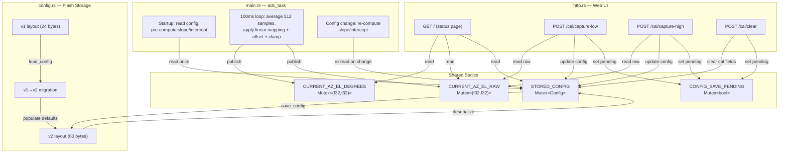

# Design Document: ADC Voltage Calibration

## Overview

This feature replaces the hardcoded theoretical ADC-to-degrees conversion in `adc_task` with a user-driven two-point linear calibration system. Users capture raw ADC readings at two known physical rotator positions via the web UI, and the firmware derives a per-axis linear mapping (`degrees = m * raw + b`) that persists across power cycles in flash.

The design touches four modules:
- `config.rs` — expanded Config struct (v1→v2 migration), new calibration fields, larger serialized size
- `main.rs` (`adc_task`) — reads calibration from `STORED_CONFIG`, pre-computes slope/intercept, applies linear mapping with offset
- `http.rs` — three new POST endpoints (`/cal/capture-low`, `/cal/capture-high`, `/cal/clear`), new calibration HTML section
- `crc8_ccitt.rs` — unchanged, CRC8 covers the larger buffer

Key constraints:
- `no_std`, no heap — all buffers are stack-allocated fixed arrays
- Per-sample overhead in `adc_task` must be zero — calibration parameters are pre-computed outside the sampling loop
- Flash sector is 4KB; config grows from 24 to 60 bytes — well within a single sector
- Version migration must be atomic: read v1 → populate v2 defaults → write v2

## Architecture



## Components and Interfaces

### 1. Config Struct Expansion (`config.rs`)

The `Config` struct gains 9 new fields (8× f32 + 1× bool). The serialized flash layout bumps from v1 (24 bytes) to v2 (60 bytes).

**New fields:**
```rust
pub struct Config {
    // Existing v1 fields (unchanged semantics)
    pub static_ip_enabled: bool,
    pub static_ip: [u8; 4],
    pub az_cal_offset: f32,
    pub el_cal_offset: f32,
    pub park_az: f32,
    pub park_el: f32,

    // New v2 calibration fields
    pub calibration_valid: bool,
    pub az_raw_low: f32,
    pub az_raw_high: f32,
    pub el_raw_low: f32,
    pub el_raw_high: f32,
    pub az_deg_low: f32,
    pub az_deg_high: f32,
    pub el_deg_low: f32,
    pub el_deg_high: f32,
}
```

**Interface changes:**
- `CONFIG_VERSION` → `0x02`, `CONFIG_SIZE` → `60`
- `to_bytes()` → serializes 59 data bytes + 1 CRC8 byte
- `from_bytes()` → dispatches on version byte: v1 migrates, v2 deserializes, other returns `None`
- `from_bytes_v1()` — new private method: reads the 24-byte v1 layout, populates v2 defaults for calibration fields
- `default()` — sets `calibration_valid: false`, all cal fields to `0.0`

### 2. Flash Layout v2 (`config.rs`)

```
Offset  Size  Field
[0]     1     Magic (0xAE)
[1]     1     Version (0x02)
[2]     1     Flags (bit 0 = static IP)
[3..7]  4     Static IP
[7..11] 4     az_cal_offset (f32 LE)
[11..15] 4    el_cal_offset (f32 LE)
[15..19] 4    park_az (f32 LE)
[19..23] 4    park_el (f32 LE)
[23]    1     Calibration flags (bit 0 = calibration_valid)
[24..28] 4    az_raw_low (f32 LE)
[28..32] 4    az_raw_high (f32 LE)
[32..36] 4    el_raw_low (f32 LE)
[36..40] 4    el_raw_high (f32 LE)
[40..44] 4    az_deg_low (f32 LE)
[44..48] 4    az_deg_high (f32 LE)
[48..52] 4    el_deg_low (f32 LE)
[52..56] 4    el_deg_high (f32 LE)
[56..59] 3    Reserved (0x00) — future expansion padding
[59]    1     CRC8-CCITT over bytes [0..59]
```

Total: 60 bytes. The first 23 bytes of data match v1 layout byte-for-byte (excluding CRC position), enabling straightforward migration.

### 3. Version Migration Logic (`config.rs`)

```rust
fn from_bytes(buf: &[u8; CONFIG_SIZE_V2]) -> Option<Self> {
    if buf[0] != CONFIG_MAGIC { return None; }

    match buf[1] {
        0x01 => Self::from_bytes_v1(buf),  // migrate
        0x02 => Self::from_bytes_v2(buf),  // native
        _    => None,                       // unknown → defaults
    }
}

fn from_bytes_v1(buf: &[u8; CONFIG_SIZE_V2]) -> Option<Self> {
    // V1 is 24 bytes: validate CRC over buf[0..23], CRC at buf[23]
    let v1_slice: [u8; 24] = buf[..24].try_into().ok()?;
    if !crc8_ccitt::crc8_ccitt_validate(&v1_slice) { return None; }

    // Parse v1 fields from their known offsets
    // Set calibration_valid = false, all cal fields = 0.0
    // Return populated Config
}
```

The `load_config` function reads a full 60-byte buffer from flash. If the flash contains only 24 valid v1 bytes, the remaining bytes will be `0xFF` (erased flash), but `from_bytes_v1` only validates the first 24 bytes.

### 4. ADC Task Modification (`main.rs`)

**Pre-computed calibration parameters:**
```rust
// Computed once at startup and on config change
struct CalParams {
    az_slope: f32,     // (az_deg_high - az_deg_low) / (az_raw_high - az_raw_low)
    az_intercept: f32, // az_deg_low - az_slope * az_raw_low
    el_slope: f32,
    el_intercept: f32,
    az_offset: f32,    // az_cal_offset from config
    el_offset: f32,    // el_cal_offset from config
    use_cal_az: bool,  // calibration_valid AND passes validation
    use_cal_el: bool,  // calibration_valid AND passes validation (per-axis)
}
```

**Validation logic** (computed when loading cal params):
- `use_cal_az = calibration_valid && (az_raw_high - az_raw_low).abs() >= 100.0 && az_deg_high != az_deg_low`
- `use_cal_el = calibration_valid && (el_raw_high - el_raw_low).abs() >= 100.0 && el_deg_high != el_deg_low`

**Conversion in the hot loop:**
```rust
// Per-axis, inside the 100ms averaging loop (NOT per-sample)
if cal.use_cal_az {
    candidate_az_degrees = (cal.az_slope * candidate_az_raw + cal.az_intercept + cal.az_offset)
        .clamp(0.0, 450.0);
} else {
    // Existing theoretical conversion + offset
    candidate_az_degrees = ((candidate_az_raw - ADC_RAW_AZ_LOW)
        / ((ADC_RAW_AZ_HIGH - ADC_RAW_AZ_LOW) / 450.0) + cal.az_offset)
        .clamp(0.0, 450.0);
}
```

**Config change detection:** The `adc_task` checks a generation counter or re-reads `STORED_CONFIG` once per 100ms tick (outside the sample accumulation loop). This adds negligible overhead — one mutex lock per 100ms, not per sample.

### 5. Web UI Endpoints (`http.rs`)

**New routes:**
| Method | Path | Action |
|--------|------|--------|
| POST | `/cal/capture-low` | Read `CURRENT_AZ_EL_RAW`, store as low ref with user-provided degrees |
| POST | `/cal/capture-high` | Read `CURRENT_AZ_EL_RAW`, store as high ref with user-provided degrees, set `calibration_valid` if both points present |
| POST | `/cal/clear` | Reset all cal fields to 0.0, set `calibration_valid = false` |

All three endpoints follow the existing pattern: parse form body → update `STORED_CONFIG` → set `CONFIG_SAVE_PENDING` → respond 303 redirect to `/`.

**Request routing** extends the existing `if/else if` chain in `http_server`:
```rust
} else if starts_with(req, b"POST /cal/capture-low") {
    let _ = handle_cal_capture_low(&mut socket, req).await;
} else if starts_with(req, b"POST /cal/capture-high") {
    let _ = handle_cal_capture_high(&mut socket, req).await;
} else if starts_with(req, b"POST /cal/clear") {
    let _ = handle_cal_clear(&mut socket, req).await;
}
```

**Capture Low handler:**
```rust
async fn handle_cal_capture_low(socket: &mut TcpSocket<'_>, req: &[u8]) -> Result<(), ...> {
    let body = find_body(req).unwrap_or(b"");
    let (az_raw, el_raw) = CURRENT_AZ_EL_RAW.lock(|f| *f.borrow());

    let az_deg = get_form_value(body, b"adl=").and_then(parse_f32).unwrap_or(0.0);
    let el_deg = get_form_value(body, b"edl=").and_then(parse_f32).unwrap_or(0.0);

    STORED_CONFIG.lock(|f| {
        if let Some(ref mut cfg) = *f.borrow_mut() {
            cfg.az_raw_low = az_raw;
            cfg.el_raw_low = el_raw;
            cfg.az_deg_low = az_deg;
            cfg.el_deg_low = el_deg;
        }
    });
    CONFIG_SAVE_PENDING.lock(|f| f.replace(true));
    // 303 redirect
}
```

Capture High is analogous but additionally checks if both low and high are populated to set `calibration_valid = true`.

### 6. Calibration UI Section (`http.rs`)

Added after the existing Configuration form in `serve_status_page`. Renders:
- Calibration status badge ("Calibrated" / "Uncalibrated")
- If calibrated: table of stored reference values
- Live raw ADC values (already available from `CURRENT_AZ_EL_RAW`)
- Capture Low form: two input fields (az_deg_low default 0.0, el_deg_low default 0.0) + submit button
- Capture High form: two input fields (az_deg_high default 450.0, el_deg_high default 180.0) + submit button
- Clear Calibration button (simple POST form with no fields)

Buffer impact: the calibration HTML section adds ~400 bytes of output. The existing `serve_status_page` already streams in chunks via multiple `socket.write_all()` calls, so this fits the pattern without increasing the 512-byte format buffer.

## Data Models

### Config Struct (Runtime)

```rust
#[derive(Clone)]
pub struct Config {
    // v1 fields
    pub static_ip_enabled: bool,   // 1 byte (padded)
    pub static_ip: [u8; 4],        // 4 bytes
    pub az_cal_offset: f32,        // 4 bytes
    pub el_cal_offset: f32,        // 4 bytes
    pub park_az: f32,              // 4 bytes
    pub park_el: f32,              // 4 bytes

    // v2 calibration fields
    pub calibration_valid: bool,   // 1 byte (padded)
    pub az_raw_low: f32,           // 4 bytes
    pub az_raw_high: f32,          // 4 bytes
    pub el_raw_low: f32,           // 4 bytes
    pub el_raw_high: f32,          // 4 bytes
    pub az_deg_low: f32,           // 4 bytes
    pub az_deg_high: f32,          // 4 bytes
    pub el_deg_low: f32,           // 4 bytes
    pub el_deg_high: f32,          // 4 bytes
}
// Rust struct size: ~56 bytes (with alignment padding)
// Flash serialized size: 60 bytes (packed, no padding)
```

### CalParams (ADC Task Local)

```rust
struct CalParams {
    az_slope: f32,
    az_intercept: f32,
    el_slope: f32,
    el_intercept: f32,
    az_offset: f32,
    el_offset: f32,
    use_cal_az: bool,
    use_cal_el: bool,
}
```

Stack-local to `adc_task`. Recomputed on config change. 28 bytes.

### Memory Impact

| Resource | Before | After | Delta |
|----------|--------|-------|-------|
| Config struct (RAM) | ~24 bytes | ~56 bytes | +32 bytes |
| Flash serialized | 24 bytes | 60 bytes | +36 bytes |
| CalParams (stack) | 0 | 28 bytes | +28 bytes |
| HTTP HTML output | ~1.2KB | ~1.6KB | +400 bytes |
| Code size (est.) | — | — | +~800 bytes |

All well within the 138KB available RAM and 2MB flash budget.


## Correctness Properties

*A property is a characteristic or behavior that should hold true across all valid executions of a system — essentially, a formal statement about what the system should do. Properties serve as the bridge between human-readable specifications and machine-verifiable correctness guarantees.*

### Property 1: Config v2 serialization round-trip

*For any* valid `Config` value (with arbitrary f32 field values and boolean flags), serializing with `to_bytes()` then deserializing with `from_bytes()` should produce a `Config` that is field-for-field equal to the original.

**Validates: Requirements 1.1, 1.2, 1.3, 2.3**

### Property 2: CRC8 integrity invariant

*For any* valid `Config` value, the byte buffer produced by `to_bytes()` should satisfy `crc8_ccitt_validate()` — i.e., the last byte equals the CRC8-CCITT of all preceding bytes.

**Validates: Requirements 2.5**

### Property 3: v1→v2 migration preserves existing fields

*For any* valid v1 `Config` (with arbitrary static_ip, cal offsets, and park values), serializing as v1 bytes and then deserializing with the v2 `from_bytes()` should produce a `Config` where all v1 fields match the original, `calibration_valid` is `false`, and all calibration raw/degree fields are `0.0`.

**Validates: Requirements 2.2, 7.3**

### Property 4: Unknown version returns None

*For any* version byte that is not `0x01` or `0x02`, a buffer with magic `0xAE` and that version byte should cause `from_bytes()` to return `None`.

**Validates: Requirements 2.4**

### Property 5: Linear mapping reproduces reference points

*For any* two distinct reference points `(raw_low, deg_low)` and `(raw_high, deg_high)` where `raw_high - raw_low >= 100.0` and `deg_high != deg_low`, the linear mapping function evaluated at `raw_low` should produce `deg_low`, and evaluated at `raw_high` should produce `deg_high` (within f32 tolerance).

**Validates: Requirements 6.1, 6.2**

### Property 6: Output clamping invariant

*For any* raw ADC value (0–4095) and *any* calibration parameters (valid or theoretical), the computed azimuth degrees must be in `[0.0, 450.0]` and elevation degrees must be in `[0.0, 180.0]`.

**Validates: Requirements 6.4**

### Property 7: Offset is additive before clamping

*For any* raw ADC value, calibration parameters, and offset value, the conversion result should equal `linear_map(raw) + offset` clamped to the valid range. Equivalently: for zero offset, the result equals the clamped linear mapping; for non-zero offset, the result shifts by exactly the offset amount (unless clamped).

**Validates: Requirements 7.1, 7.2**

### Property 8: Clear calibration zeroes all calibration fields

*For any* `Config` with arbitrary calibration data, applying the clear-calibration operation should produce a `Config` where `calibration_valid` is `false` and all eight calibration fields (`az_raw_low`, `az_raw_high`, `el_raw_low`, `el_raw_high`, `az_deg_low`, `az_deg_high`, `el_deg_low`, `el_deg_high`) are `0.0`, while all non-calibration fields remain unchanged.

**Validates: Requirements 5.1**

### Property 9: calibration_valid is set when both reference points are present

*For any* `Config` where both low and high capture data are populated (all four raw values and all four degree values are non-zero), the `calibration_valid` flag should be set to `true` after the capture-high operation.

**Validates: Requirements 4.3**

## Error Handling

### Flash Errors

- **Read failure**: `load_config` returns `Config::default()` (existing behavior, unchanged).
- **Write failure**: `save_config` returns `false`, logs error via defmt. The in-memory `STORED_CONFIG` remains updated — calibration works for the current session but won't persist. User can retry via the web UI.
- **CRC mismatch on read**: `from_bytes` returns `None` → `Config::default()`. This handles both corruption and partial writes.

### Version Migration Errors

- **v1 CRC invalid**: `from_bytes_v1` returns `None` → defaults. The user loses their v1 settings but gets a working system.
- **Unknown version byte**: `from_bytes` returns `None` → defaults. Forward-compatible: a future v3 firmware won't crash on v2 data, it just resets.

### Calibration Validation Failures

- **Raw span < 100 counts** (per-axis): The `CalParams` computation sets `use_cal_az`/`use_cal_el` to `false` for the affected axis. The other axis can still use calibration independently. The web UI continues to show the stored calibration data — it's not deleted, just not applied.
- **Degree span = 0** (per-axis): Same fallback as above. Prevents division by zero in slope computation.
- **NaN/Inf in f32 fields**: The `clamp()` call on the final degree value will produce `0.0` for NaN inputs (Rust's `f32::clamp` returns the lower bound for NaN). This is a safe degradation — the position reads as 0° rather than crashing.

### HTTP Parsing Errors

- **Missing form fields**: `get_form_value` returns `None`, `parse_f32` returns `None` → the handler uses default values (0.0 for degree fields). The capture still proceeds with the raw ADC snapshot.
- **Malformed degree values**: `parse_f32` returns `None` → default 0.0 used. No error response — the 303 redirect still happens.
- **Request buffer overflow**: The existing 512-byte `req_buf` is sufficient for the new POST bodies (form fields are short: `adl=0.0&edl=0.0` is ~15 bytes). If truncated, `find_body` may return a partial body, and missing fields get defaults.

## Testing Strategy

### Property-Based Testing

The project already has `proptest` as a dev-dependency. All correctness properties will be implemented as proptest tests in a `tests/` directory or inline `#[cfg(test)]` module.

**Library**: `proptest 1.x` (already in `Cargo.toml` dev-dependencies)

**Configuration**: Each property test runs a minimum of 100 iterations (proptest default is 256, which exceeds this).

**Test tagging**: Each test function includes a comment referencing the design property:
```rust
// Feature: adc-voltage-calibration, Property 1: Config v2 serialization round-trip
```

**Important**: The firmware target is `thumbv6m-none-eabi` (no_std), but proptest requires `std`. Property tests must be structured to test pure logic extracted into functions that can be compiled for the host target. The `config.rs` serialization/deserialization functions and the linear mapping math are pure functions that don't depend on Embassy or hardware — these are the testable surface.

**Test structure**:
- Extract `to_bytes`, `from_bytes`, `from_bytes_v1`, linear mapping, and validation logic into pure functions testable on the host
- Property tests live in `firmware/tests/` as integration tests compiled for the host target, or in `#[cfg(test)]` modules with appropriate `#[cfg(not(target_arch = "arm"))]` guards
- Generators produce random `Config` values with f32 fields in realistic ranges (raw: 0–4095, degrees: 0–450 az / 0–180 el, offsets: -50–50)

### Property Test Plan

| Property | Test Description | Generator Strategy |
|----------|------------------|--------------------|
| P1 | Round-trip: `from_bytes(to_bytes(cfg)) == cfg` | Random Config with all fields |
| P2 | CRC: `crc8_ccitt_validate(to_bytes(cfg))` | Random Config |
| P3 | Migration: serialize as v1, deserialize as v2, check fields | Random v1-compatible Config |
| P4 | Unknown version: `from_bytes(buf_with_bad_version) == None` | Random version ∉ {0x01, 0x02} |
| P5 | Linear map at reference points returns reference degrees | Random (raw_low, raw_high, deg_low, deg_high) with constraints |
| P6 | Clamping: output ∈ [0, 450] for az, [0, 180] for el | Random raw values 0–4095, random cal params |
| P7 | Offset: `convert(raw, cal, offset) == clamp(linear(raw) + offset)` | Random raw, cal, offset |
| P8 | Clear: all cal fields zeroed, non-cal fields preserved | Random Config |
| P9 | Valid flag: set true when both points populated | Random Config with both points filled |

### Unit Tests

Unit tests complement property tests for specific examples and edge cases:

- **Default config**: Verify `Config::default()` has `calibration_valid == false` and all cal fields `== 0.0` (Req 1.4)
- **Version byte**: Verify `to_bytes()[1] == 0x02` (Req 2.1)
- **Theoretical fallback**: Verify that with `calibration_valid == false`, the theoretical constants produce expected degrees for known raw values (Req 6.3)
- **Edge case — raw span exactly 100**: Verify calibration is accepted (boundary of Req 9.1/9.2)
- **Edge case — raw span 99**: Verify calibration is rejected (Req 9.1/9.2)
- **Edge case — equal degree values**: Verify calibration is rejected (Req 9.3/9.4)
- **Edge case — NaN in calibration fields**: Verify graceful degradation
- **Capture Low then High sequence**: Verify `calibration_valid` transitions from false to true
