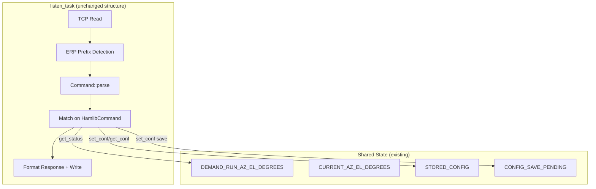

# Design: Full rotctld Protocol Support

## Overview

This design extends the G-5500 Hamlib Adaptor firmware to implement the complete rotctld command dispatch table from Hamlib's `rotctl_parse.c`. The current firmware handles 10 commands sufficient for Gpredict; this expansion adds ~15 more commands to achieve full protocol compliance with the NET rotctl backend (`netrotctl.c`).

The key changes are:

1. **Rewrite `dump_state`** to emit the protocol version 1 wire format that `netrotctl_open()` parses (key=value pairs terminated by `done`)
2. **Add diagonal move directions** (UP_LEFT, UP_RIGHT, DOWN_LEFT, DOWN_RIGHT) mapping to simultaneous relay activation
3. **Add `get_status`** returning `rot_status_t` flags derived from the existing `DEMAND_RUN_AZ_EL_DEGREES` shared state
4. **Add `set_conf`/`get_conf`/`dump_conf`** backed by the existing `Config` struct and flash storage
5. **Add stub commands** (`set_level`, `get_level`, `set_func`, `get_func`, `set_parm`, `get_parm`, `send_cmd`, locator commands) returning `RPRT -4` (RIG_ENIMPL)
6. **Fix unrecognized command error** from `RPRT 1` to `RPRT -1`
7. **Ensure ERP compliance** for all new commands

All changes stay within the existing architecture: no heap, no new tasks, no buffer size increases.

## Architecture

The existing architecture remains unchanged. All new functionality is contained within two areas:



### Design Decision: Single-file approach

All parser and handler changes remain in `main.rs`. The `HamlibCommand` enum grows from 11 to ~26 variants, but each new variant adds minimal code — most are stubs returning a fixed error. Extracting to a separate module would add complexity without benefit at this scale.

### Design Decision: Argument handling via parse return tuple

The current `Command::parse()` returns `(HamlibCommand, f32, f32)`. This works for commands with 0-2 numeric args. For `set_conf` and `get_conf` which need string arguments (token name, value), we extend the return type to include an optional byte-slice range into the input buffer. This avoids heap allocation and keeps the parser zero-copy.

New return type: `(HamlibCommand, f32, f32, Option<(&[u8], &[u8])>)` where the `Option` carries `(token_bytes, value_bytes)` for conf commands.

## Components and Interfaces

### Extended HamlibCommand Enum

```rust
#[derive(PartialEq, Eq)]
enum HamlibCommand {
    // Existing
    GetInfo, GetPos, Stop, Park, SetPos, Move, Quit,
    DumpState, DumpCaps, Reset,
    // New — functional
    GetStatus, SetConf, GetConf, DumpConf,
    // New — stubs (RPRT -4)
    SetLevel, GetLevel, SetFunc, GetFunc,
    SetParm, GetParm, SendCmd,
    // Locator stubs (RPRT -4)
    Lonlat2Loc, Loc2Lonlat, Dms2Dec, Dec2Dms,
    Dmmm2Dec, Dec2Dmmm, Qrb, AzSp2AzLp, DistSp2DistLp,
    // Sentinel
    _None,
}
```

### Parser Extensions

Each new command gets a `parse_*` function following the existing pattern. Commands are grouped by argument shape:

| Group | Commands | Parser Pattern |
|-------|----------|---------------|
| No args | `s`/`\get_status`, `3`/`\dump_conf` | `alt((tag("s"), tag("\\get_status")))` |
| Consume-and-ignore args | `V`/`\set_level`, `v`/`\get_level`, etc. | Match prefix, ignore remainder |
| String args | `C`/`\set_conf`, `\get_conf` | Match prefix, extract token + optional value as byte slices |
| Reset with optional arg | `R`/`\reset` | Match prefix, optionally consume space + integer |

For stub commands that take arguments (e.g., `V <level> <value>`), the parser matches the command prefix and discards the rest of the line. This prevents argument bytes from being misinterpreted as a separate command.

### dump_state Wire Format

The `netrotctl_open()` function in `netrotctl.c` expects this exact sequence when `ROTCTLD_PROT_VER == 1`:

```
1\n
<rot_model>\n
min_az=0.000000\n
max_az=450.000000\n
min_el=0.000000\n
max_el=180.000000\n
south_zero=0\n
rot_type=AzEl\n
done\n
```

The rotator model number will use a fixed value (e.g., `601` for ROT_MODEL_NETROTCTL, matching what clients expect from a network rotator). The `%lf` format in the C code produces 6 decimal places by default — we match this with `{:.6}` in Rust's `format_args!`.

### Diagonal Move Direction Mapping

Direction codes from `rotator.h`:

| Code | Name | Relays Activated |
|------|------|-----------------|
| 2 | UP | el_up |
| 4 | DOWN | el_dn |
| 8 | LEFT/CCW | az_ccw |
| 16 | RIGHT/CW | az_cw |
| 32 | UP_LEFT/UP_CCW | el_up + az_ccw |
| 64 | UP_RIGHT/UP_CW | el_up + az_cw |
| 128 | DOWN_LEFT/DOWN_CCW | el_dn + az_ccw |
| 256 | DOWN_RIGHT/DOWN_CW | el_dn + az_cw |

Diagonal moves set demand to the extreme in both axes simultaneously. For example, UP_RIGHT sets demand to `(CONTROL_AZ_DEGREES_MAXIMUM, CONTROL_EL_DEGREES_MAXIMUM)`, causing `control_task` to drive both CW and UP relays.

### get_status Implementation

Derives status from `DEMAND_RUN_AZ_EL_DEGREES`:

```rust
// If demand_run is true, rotator is moving
// ROT_STATUS_MOVING = (1 << 1) = 2
// ROT_STATUS_NONE = 0
let status: u32 = if demand_run { 2 } else { 0 };
```

The response format is the integer status value as a string, matching `rot_sprintf_status()` output for simple cases. When not moving, returns `0`. When moving, returns `2` (ROT_STATUS_MOVING).

### set_conf / get_conf / dump_conf

Supported tokens map directly to `Config` struct fields:

| Token | Config Field | Type |
|-------|-------------|------|
| `min_az` | (constant) | f32 — always 0.0 |
| `max_az` | (constant) | f32 — always 450.0 |
| `min_el` | (constant) | f32 — always 0.0 |
| `max_el` | (constant) | f32 — always 180.0 |
| `park_az` | `park_az` | f32 |
| `park_el` | `park_el` | f32 |

`min_az`, `max_az`, `min_el`, `max_el` are read-only (hardware limits). `set_conf` on these returns `RPRT 0` but does not change the value (or alternatively returns `RPRT -2`). `park_az` and `park_el` are writable and trigger `CONFIG_SAVE_PENDING` for flash persistence.

`dump_conf` outputs all tokens:
```
min_az=0.000000
max_az=450.000000
min_el=0.000000
max_el=180.000000
park_az=180.000000
park_el=0.000000
```

### ERP Response Format

All new commands follow the existing ERP pattern:

```
// Standard mode:
RPRT <code>\n

// ERP mode:
<long_command_name>:\n
[optional output lines]\n
RPRT <code>\n
```

For stub commands in ERP mode: `set_level:\nRPRT -4\n`

### Hamlib Error Codes

| Code | Constant | Meaning |
|------|----------|---------|
| 0 | RIG_OK | Success |
| -1 | RIG_EINVAL | Invalid parameter / unrecognized command |
| -2 | RIG_EINVAL | Invalid parameter (used for bad conf tokens) |
| -4 | RIG_ENIMPL | Not implemented |

The current `_None` handler returns `RPRT 1` in standard mode — this is corrected to `RPRT -1`.


## Data Models

### Extended Parse Return Type

```rust
/// Parse result carrying command type, two f32 args, and optional string arg pair.
/// String args reference slices of the input buffer (zero-copy).
struct ParseResult<'a> {
    command: HamlibCommand,
    arg1: f32,
    arg2: f32,
    str_args: Option<(&'a [u8], &'a [u8])>,  // (token, value) for conf commands
}
```

Alternatively, to minimize changes, `Command::parse()` can return a 4-tuple `(HamlibCommand, f32, f32, Option<(&[u8], &[u8])>)`. The handler in `listen_task` destructures this and uses the string args only for `SetConf`/`GetConf`.

### Config Token Enum

Rather than string matching at runtime, define a small enum for recognized tokens:

```rust
enum ConfigToken {
    MinAz, MaxAz, MinEl, MaxEl, ParkAz, ParkEl,
}

impl ConfigToken {
    fn from_bytes(input: &[u8]) -> Option<Self> {
        match input {
            b"min_az" => Some(Self::MinAz),
            b"max_az" => Some(Self::MaxAz),
            b"min_el" => Some(Self::MinEl),
            b"max_el" => Some(Self::MaxEl),
            b"park_az" => Some(Self::ParkAz),
            b"park_el" => Some(Self::ParkEl),
            _ => None,
        }
    }
}
```

### Direction Code Constants

```rust
const ROT_MOVE_UP: u16 = 2;
const ROT_MOVE_DOWN: u16 = 4;
const ROT_MOVE_LEFT: u16 = 8;
const ROT_MOVE_RIGHT: u16 = 16;
const ROT_MOVE_UP_LEFT: u16 = 32;
const ROT_MOVE_UP_RIGHT: u16 = 64;
const ROT_MOVE_DOWN_LEFT: u16 = 128;
const ROT_MOVE_DOWN_RIGHT: u16 = 256;
```

### Status Flags

```rust
const ROT_STATUS_NONE: u32 = 0;
const ROT_STATUS_MOVING: u32 = 2;  // (1 << 1)
```

### dump_state Response Buffer

The dump_state response is ~180 bytes. A 256-byte stack buffer is sufficient. The format uses `{:.6}` for f64-equivalent precision matching the C `%lf` default.

### Memory Impact

| Item | RAM | Flash |
|------|-----|-------|
| New enum variants (zero-size) | 0 | ~0 |
| New parse functions (~15) | 0 | ~2-3KB |
| New match arms in listen_task | 0 | ~1-2KB |
| ConfigToken enum + from_bytes | 0 | ~200B |
| Direction constants | 0 | ~32B |
| **Total estimated** | **0 extra RAM** | **~3-5KB extra flash** |

All response formatting uses existing stack buffers within `listen_task`. No new static allocations needed.


## Correctness Properties

*A property is a characteristic or behavior that should hold true across all valid executions of a system — essentially, a formal statement about what the system should do. Properties serve as the bridge between human-readable specifications and machine-verifiable correctness guarantees.*

### Property 1: Direction code mapping and move response

*For any* integer direction code, if the code is in the valid set {2, 4, 8, 16, 32, 64, 128, 256}, then the move handler should set the demand position to the correct axis extremes (e.g., UP_RIGHT → max az + max el) and the response should be `RPRT 0`; if the code is not in the valid set, the response should be `RPRT -2`.

**Validates: Requirements 2.1, 2.2, 2.3, 2.4, 2.5, 2.6**

### Property 2: Status flag derivation from demand state

*For any* boolean `demand_run` value, the `get_status` handler should return status `2` (ROT_STATUS_MOVING) when `demand_run` is true, and status `0` (ROT_STATUS_NONE) when `demand_run` is false.

**Validates: Requirements 4.2, 4.3**

### Property 3: Config parameter round-trip

*For any* writable config token (`park_az`, `park_el`) and any valid f32 value, calling `set_conf` with that token and value, then calling `get_conf` with the same token, should return the same value (within floating-point formatting precision).

**Validates: Requirements 5.2, 5.4**

### Property 4: Unrecognized config token rejection

*For any* byte string that is not one of the recognized config tokens (`min_az`, `max_az`, `min_el`, `max_el`, `park_az`, `park_el`), both `set_conf` and `get_conf` should respond with `RPRT -2`.

**Validates: Requirements 5.3, 5.5**

### Property 5: Stub commands return RPRT -4 regardless of trailing arguments

*For any* stub command (set_level, get_level, set_func, get_func, set_parm, get_parm, send_cmd, and all locator commands) followed by any arbitrary trailing byte sequence, the parser should recognize the command and the handler should respond with `RPRT -4`.

**Validates: Requirements 7.1, 7.2, 7.3, 7.4, 7.5, 7.6, 7.7, 10.1, 11.4**

### Property 6: Unrecognized commands return RPRT -1

*For any* byte sequence that does not match any recognized command prefix (short or long form), the handler should respond with `RPRT -1` in both standard and ERP modes.

**Validates: Requirements 8.1, 8.2**

### Property 7: ERP response format for all commands

*For any* recognized command sent with an ERP prefix character (e.g., `+`), the response should begin with the long command name followed by `:\n`, and end with `RPRT <code>\n`.

**Validates: Requirements 9.1, 9.2, 9.3**

### Property 8: Parser command round-trip

*For any* `HamlibCommand` variant (excluding `_None`), formatting the variant as its canonical long-form command string and then parsing that string should produce the same `HamlibCommand` variant.

**Validates: Requirements 11.5**

## Error Handling

### Parse Errors

- **Unrecognized command**: Returns `RPRT -1` (corrected from current `RPRT 1`). In ERP mode, also returns `RPRT -1` (no command name prefix since the command is unknown).
- **Missing arguments for set_conf**: If `C` is received without token/value, returns `RPRT -2`.
- **Invalid float in set_conf value**: If the value string cannot be parsed as f32, returns `RPRT -2`.

### Runtime Errors

- **Config save failure**: `set_conf` for writable tokens sets `CONFIG_SAVE_PENDING`. If flash write fails, the in-memory value is still updated for the session. The flash save is best-effort (existing behavior).
- **Buffer overflow in dump_state**: The response is a fixed ~180 bytes. A 256-byte stack buffer is used. If `format_no_std::show` returns an error (buffer too small), the response is truncated but the socket write proceeds with whatever was formatted. This matches existing behavior for other commands.

### Stub Command Arguments

Stub commands that take arguments in the protocol (e.g., `V <level> <value>`) must consume those arguments from the input buffer even though they're ignored. If the parser only matches the command prefix, leftover argument bytes could be interpreted as the next command. The parser handles this by matching the command prefix and discarding the remainder of the input line.

### Direction Code Validation

The Move handler validates the direction code against the set of 8 known values. Any other value returns `RPRT -2` (RIG_EINVAL). This is a change from the current behavior which returns `RPRT -1` for unknown directions.

## Testing Strategy

### Testing Framework

- **Unit tests**: Standard Rust `#[cfg(test)]` module within the firmware crate, using `#[test]` functions
- **Property-based tests**: Using the `proptest` crate (supports `no_std` via `default-features = false, features = ["alloc"]` for test builds only)
- Tests run on the host (`x86_64`) not on target — the parser and logic functions are pure and platform-independent

### What to Test

The testable surface is the pure logic extracted from the firmware:

1. **`Command::parse()`** — input bytes → `(HamlibCommand, f32, f32, Option<(&[u8], &[u8])>)`
2. **`ConfigToken::from_bytes()`** — input bytes → `Option<ConfigToken>`
3. **Direction-to-demand mapping** — direction code → `(az_demand, el_demand)` or error
4. **Status derivation** — `demand_run` bool → status integer
5. **dump_state formatting** — config values → formatted byte string
6. **dump_conf formatting** — config values → formatted byte string
7. **ERP response formatting** — command + response → prefixed response

### Property-Based Tests

Each property test runs a minimum of 100 iterations. Each test is tagged with a comment referencing the design property.

| Property | Test Description | Generator |
|----------|-----------------|-----------|
| P1 | Direction mapping | Random u16 values (0..1024) |
| P2 | Status derivation | Random bool |
| P3 | Config round-trip | Random f32 in valid range × {park_az, park_el} |
| P4 | Token rejection | Random alphanumeric strings not in token set |
| P5 | Stub RPRT -4 | Random stub command × random trailing bytes |
| P6 | Unknown cmd RPRT -1 | Random bytes not matching any command prefix |
| P7 | ERP format | Random recognized command × ERP prefix |
| P8 | Parser round-trip | All HamlibCommand variants (exhaustive, not random) |

### Unit Tests

Unit tests cover specific examples and edge cases:

- dump_state exact wire format (all 9 lines, Requirement 1)
- dump_conf output contains all 6 tokens (Requirement 6)
- Parser recognizes all short-form commands (Requirement 11.1)
- Parser recognizes all long-form commands (Requirement 11.2)
- Parser recognizes all locator long-form commands (Requirement 11.3)
- `R` without argument still parses as Reset (Requirement 3.3)
- `R 1` with argument parses as Reset (Requirement 3.1)
- All 6 config tokens recognized by `ConfigToken::from_bytes` (Requirement 5.6)

### Test Configuration

```toml
# In Cargo.toml [dev-dependencies]
proptest = { version = "1", default-features = false, features = ["std"] }
```

Property tests use `proptest!` macro with `ProptestConfig { cases: 100, .. }`.

Each property test includes a tag comment:
```rust
// Feature: full-rotctld-protocol, Property 1: Direction code mapping and move response
```
